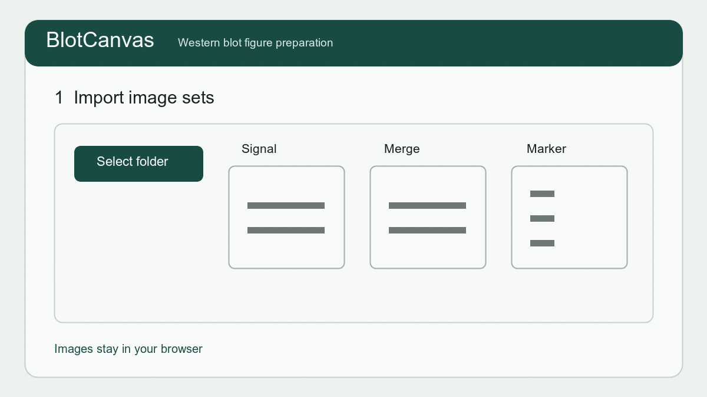

# BlotCanvas

Western blot（ウェスタンブロット）画像から、論文・学会発表用のFigure、元画像記録、簡易定量結果を作成する無料のブラウザアプリです。画像はサーバーへ送信せず、端末のブラウザ内で処理します。

[**▶ BlotCanvasを開く**](https://bonnginn.github.io/blotcanvas/) ・ [**使い方を見る**](https://bonnginn.github.io/blotcanvas/manual.html) ・ [**English**](https://bonnginn.github.io/blotcanvas/?lang=en)

English README: [README_EN.md](./README_EN.md)

> [!IMPORTANT]
> 現在の公開版はベータ版です。実際の研究データで検証を進めている段階であり、機能、操作方法、プロジェクトJSONの保存形式は今後変更される可能性があります。元画像と重要な作業結果は、必ず本アプリとは別に保管してください。

## 推奨ブラウザ

最新版の **Google Chrome** を推奨します。最新版の **Microsoft Edge** でも利用できます。Safariなどのブラウザでは、フォルダ読み込みやファイル保存の挙動が異なる場合があります。

## 特徴

- 選択した画像はサーバーへ送信せず、利用者のブラウザ内で処理
- ATTO LuminoGraphのCL・Merge・M画像をファイル名から自動分類
- その他の撮影装置では、シグナル・Merge・マーカー画像を手動で割り当て
- Mergeを出力しない装置向けに、シグナル画像と明視野／マーカー画像から作業用Mergeを生成
- TIFF・PNG・JPEG画像に対応
- 撮影ごとの水平補正、切り出し領域、Figure用画像の階調・明るさ・コントラストを調整
- 同じゲル由来のブロットで横幅を統一
- Bio-Rad Precision Plus Protein All Blueを含むマーカープリセットと自作マーカー登録
- レーン条件を階層・反復・±条件として編集
- Figureを高解像度PNG・JPEG・TIFF・PDFとして1ファイル出力
- Illustrator向け編集可能PDF、Figure SVG、切り出し位置を示した証拠保全SVGを出力
- 編集可能PDFはブロット画像を内部に埋め込み、文字・線・枠を後から編集可能
- Source recordはシグナル画像、Merge画像、または両方から選択可能
- 作業プロジェクトと再利用可能な設定テンプレートをJSONで保存
- 16-bit元画像を用いた矩形ROI定量、背景補正、正規化、グラフ・CSV出力

定量化機能はベータ版です。現段階では矩形ROIと共通背景を用いる初期実装であり、測定値は必ず元画像および既存の解析方法と照合してください。

## 基本的な使い方

初めて利用する場合は、画面上部の「はじめての方へ」または[文章マニュアル](https://bonnginn.github.io/blotcanvas/manual.html)を参照してください。マニュアル内の条件名と抗体名は、実験内容を含まない一般的な例示です。

1. 撮影装置を選び、撮影フォルダまたは画像を読み込みます。
2. ゲルごとにマーカーバンドを目安として水平を補正します。
3. ブロットごとの切り出し領域を指定します。
4. Figure用画像の階調・明るさ・コントラストを調整します。
5. 使用する分子量と、画像上のマーカーバンド位置を指定します。
6. レーン数と実験条件を入力します。
7. Figureの順番を確認し、編集可能PDF、完成画像、SVG、JSONを保存します。
8. 必要に応じて元画像上のROIと背景領域を調整し、定量・正規化します。
9. 条件表を利用したグラフを確認し、PNGまたは測定結果CSVを保存します。

## データの取り扱い

画像の読み込み、調整、切り出し、Figure作成はブラウザ内で実行します。BlotCanvasが元画像をサーバーへアップロードまたは保存する機能はありません。ブラウザや端末を変更する場合は、必要な作業内容をプロジェクトJSONとして保存してください。

公開版では、利用状況を把握するためCloudflare Web AnalyticsによるCookieを使わない匿名のページビュー統計を取得します。画像、プロジェクト内容、入力した実験条件は統計へ送信されません。

不具合・改善報告フォームを利用した場合は、フォーム提供者であるGoogleのサービス上へ、利用者が入力した内容が送信されます。患者情報、未公開画像、氏名など、報告に不要な機密情報・個人情報は入力しないでください。

BlotCanvasはOpenAI Codexを開発支援に使用して作成・改善しています。フォームへ寄せられた報告は開発者が確認し、必要に応じてCodexへ読み込ませ、問題整理、原因調査、修正案の作成に利用します。報告内容が自動的に実装されるわけではなく、必要性、科学的妥当性、優先順位、既存機能への影響を開発者が判断します。

## 現在の対象

現時点では日本語版を先に公開しています。ATTO LuminoGraphの命名規則に最適化していますが、その他の装置でも画像の役割を手動選択して利用できます。

## 今後の主要機能

### Western blot定量化の拡張

矩形ROIによる第1版を公開ベータへ実装しています。今後、より一般的なレーンプロファイルとピーク積分へ拡張します。

- レーンの縦方向Intensity profile表示
- バンドピーク範囲とbaselineの手動・補助指定
- ピーク面積の積分と、矩形ROI法との比較
- 解析領域、背景補正方法、画像調整値のログ保存
- 定量に使用した領域の証拠保全画像
- 飽和画素や解析に不適切な露光への警告強化

### 統計処理

- 独立反復データの集約
- 比較群と検定方法の明示的な選択
- エラーバー、個々のデータ点、サンプル数を含むグラフ
- 解析条件と結果の再現可能な保存

### メンブレン境界の自動取得

CL、Merge、明視野画像などからメンブレン境界の候補を推定し、作業画面で画像が占める面積を増やします。撮影範囲の不要部分を除外することで、水平補正、領域指定、マーカー配置、定量ROI操作をしやすくします。

### 作業支援の自動化

水平補正、メンブレン境界、クロップ候補、マーカー位置、レーン位置、定量ROIなどの自動提案を段階的に検討します。自動提案の利用自体を選択制とし、最初から手動で作業するモードと、工程ごとに自動提案をオン・オフする設定を用意します。利用者の選択は端末内に保存し、毎回不要な提案を閉じる操作が生じないようにします。

自動処理だけで結果を確定せず、自動提案を使用した場合も推定結果と根拠を画面上で確認でき、誤っている場合はすべて手動で修正できる設計を基本方針とします。

### 作業フォルダへの直接保存

Chrome／Edgeでは、利用者が一度選択した作業フォルダへFigure、グラフ、Source record、CSV、プロジェクトJSONを直接保存する方式を検討します。元画像は上書きしません。SafariなどFile System Access APIに対応しない環境、および保存先を指定しない場合は、従来のブラウザダウンロードへフォールバックします。

### コンパクト表示

初回は説明付きで表示します。慣れた利用者は上部の表示切替から補足説明を省略でき、選択した表示モードは同じブラウザ内に保存されます。主要な操作ボタンと科学的に重要な警告はコンパクト表示でも維持されます。

## 不具合・改善提案

アプリ上部の「不具合・改善を報告」からフォームを開けます。画像そのものを送らなくても、使用装置、操作段階、再現手順などを記載して報告できます。

## 注意

本アプリはFigure作成と画像整理を補助するツールです。画像調整・切り出し・定量化を行う場合は、所属機関、学術誌、研究公正に関する規程に従い、元画像と処理履歴を保管してください。

本アプリの出力結果の正確性、投稿規程への適合性、研究上の判断については、利用者自身で確認してください。本アプリは無保証で提供されます。

## ライセンス

BlotCanvas本体は[MIT License](./LICENSE)で公開しています。著作権者は Hironori Inaba です。利用しているオープンソースソフトウェアについては[Third-Party Notices](./THIRD_PARTY_NOTICES.md)を参照してください。

## バージョン履歴

変更内容は[CHANGELOG.md](./CHANGELOG.md)に記録します。
